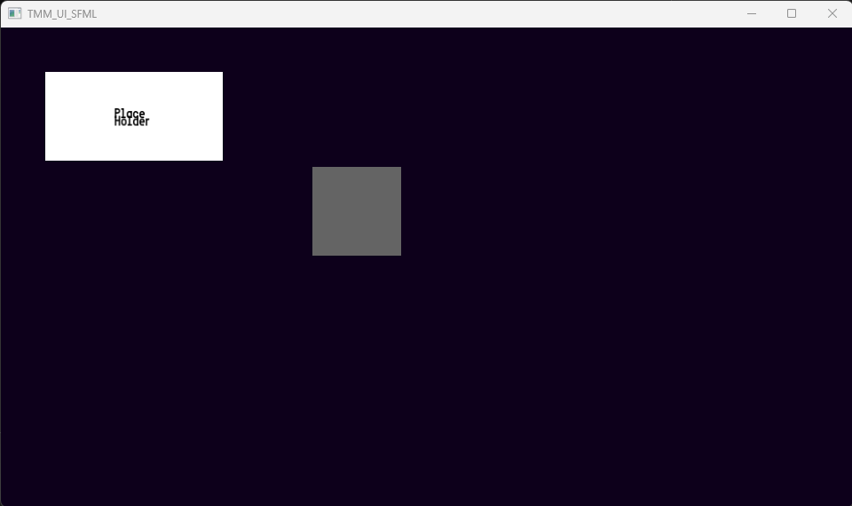
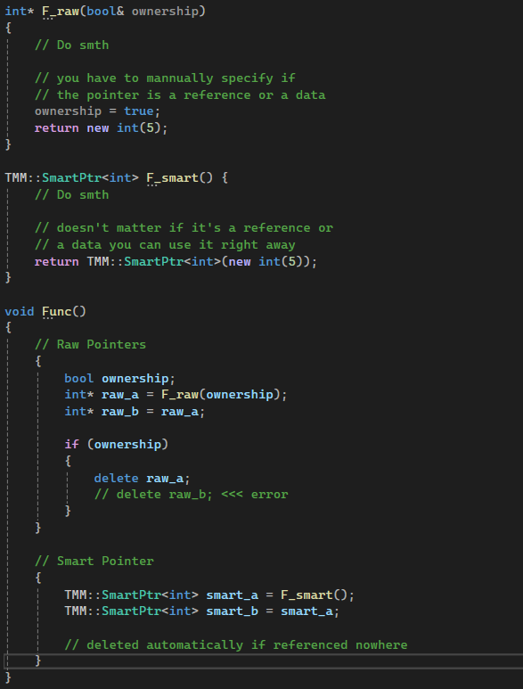

# Dev Log – UI Module & SmartPtr

## Context

Recently, I added two important features to my codebase:

- A **UI module** designed to be **graphics-library agnostic**, with a first implementation based on **SFML**
- A set of **custom SmartPtr utilities** aimed at simplifying memory management by removing the need for manual deletion

---

## UI Module – Design Goals

The main idea behind this UI project was to have a fast, easy and ready UI lib that i can use in any projects i want.

### Core objectives

- Separate **UI logic** from **rendering backend**
- Allow the same UI system to be reused with:
  - SFML
  - DirectX
  - OpenGL
  - or any other graphics API in the future
- Keep the UI code **simple, readable, and extensible**

This resulted in a design where:
- UI elements describe **what** they are
- The backend decides **how** they are rendered

---

## SFML Implementation

The first implementation of this UI system is based on **SFML**, chosen for its simplicity and fast iteration time.

This implementation handles:
- Window interaction
- Input events (mouse, keyboard)
- Rendering of basic UI elements

The UI logic itself does **not depend on SFML**, only the rendering layer does.

This makes SFML a **replaceable backend**, not a hard dependency.

---

## Why a Modular UI?

Building this system early allows me to:
- Avoid rewriting UI logic when changing graphics APIs
- Reuse the same UI in different projects
- Experiment with multiple renderers while keeping a stable interface

This approach also aligns with how larger engines structure their UI systems.

---

## SmartPtr – Motivation

In parallel, I introduced a set of **custom SmartPtr utilities**.

The goal was simple:
> **Never manually delete pointers again.**

While C++ already provides smart pointers, this implementation is tailored to my own architecture and usage patterns, with this TMM_Library, my goal is to challenge myself to create as many features as I can without using the STL (Standard Library).

### Trade-off

- Slightly higher **memory usage**
- In exchange for:
  - No manual deletion
  - Fewer memory leaks
  - Fewer ownership-related bugs
  - Clearer code intent

---

## SmartPtr – Usage & Benefits

With these SmartPtr utilities:
- Object lifetime is managed automatically
- Ownership rules are explicit
- Code becomes easier to reason about

This allows me to focus on:
- Architecture
- Features
- Performance-critical paths

Instead of constantly worrying about memory cleanup.

