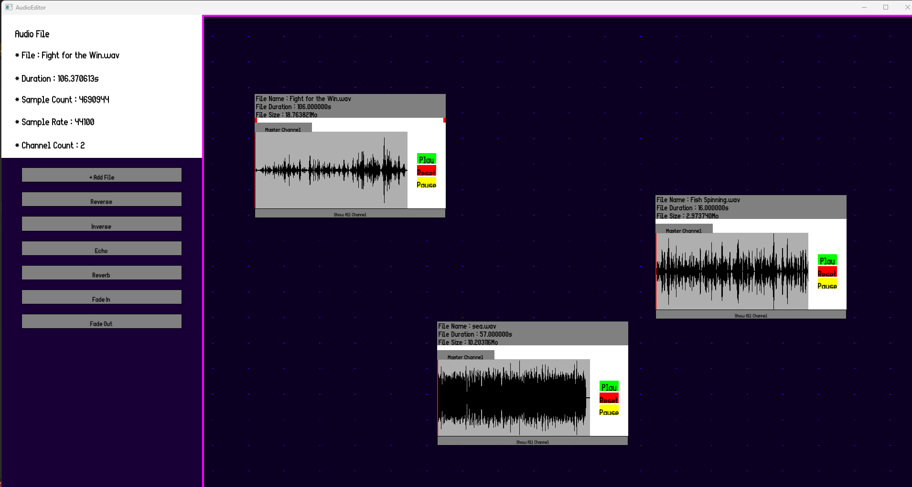
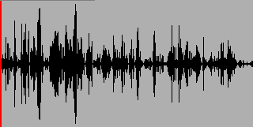
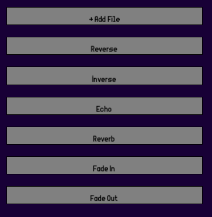
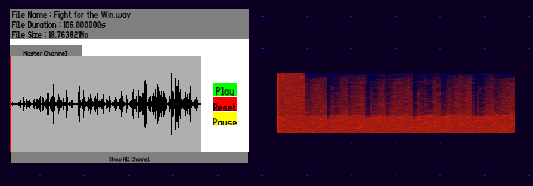
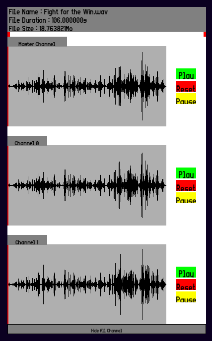

# Audio_Editor

## Introduction

**Audio_Editor** is a **node-based audio editing tool** developed in **C++** during my **third year at Gaming Campus (GTech, Tech – Engine specialization)** under the supervision of **Johann Philippe**.

The goal of this project was to build a **fully functional WAV audio editor**, capable of:
- Loading audio files
- Editing them with various transformations
- Playing them in real time
- Saving the modified result

Beyond the tool itself, this project was a deep dive into:
- **Digital signal processing fundamentals**
- **Audio data representation**
- **Low-level audio playback systems**

We chose to focus on creating a **user-friendly and visual workflow**, inspired by node-based editors commonly used in game engines and creative software.

---

## Project Context & Objectives

The project required us to:

- Work with **raw WAV file formats**
- Understand how **audio data is stored and processed**
- Implement **editing features from scratch**
- Use a **low-level API (XAudio)** to handle sound playback

Key objectives included:
- Building a **fully interactive editor**
- Providing **visual feedback of the audio signal**
- Allowing **non-destructive-style manipulation workflows**
- Keeping the tool **intuitive despite technical complexity**

---

## Node-Based Editor Interface

One of the core design choices was to build a **node-based editing interface**.

Instead of a traditional timeline-only editor, we implemented:

- An **infinite canvas**
- **Draggable audio nodes**
- A system to **organize and manipulate audio visually**

Users can:
- Create nodes representing **audio clips**
- Move them freely in space
- Select and edit them independently

This approach:
- Makes the editor more **modular and flexible**
- Encourages **experimentation**
- Aligns with workflows used in modern tools (e.g. shader graphs, visual scripting)

---

## Audio Visualization

A key feature of the editor is the **accurate waveform visualization**.

We implemented a system that:
- Reads raw audio sample data from WAV files
- Converts it into a **visual waveform representation**
- Displays it in real time inside the editor

This allowed users to:
- Precisely **see the structure of the sound**
- Make accurate **selections and edits**
- Better understand how transformations affect the signal

---

## Editing Features

The editor includes a variety of **audio manipulation tools**, all implemented from scratch:

### Basic Editing

- **Selection of audio segments**
- **Cut / Copy / Paste**
- **Reverse audio**
- **Amplitude (intensity) adjustment**

### Effects

We also implemented several classic audio effects:

- **Fade In / Fade Out**
- **Echo / Reverb (simple implementations)**

These effects required directly manipulating the **sample data**, reinforcing our understanding of:
- Signal transformations
- Time-based audio effects
- Buffer processing

---

## Frequency Analysis (FFT)

To go further, we implemented a **frequency domain analysis** using **FFT (Fast Fourier Transform)**.

This allowed us to:
- Extract frequency information from the signal
- Visualize it as a **spectrum representation**

This feature provided:
- A different perspective on sound (frequency vs time domain)
- A more **technical and analytical tool** within the editor

---

## Multi-Channel Support

The editor supports **multi-channel audio** and allows:

- Viewing each **channel independently**
- Better understanding of **stereo and spatial audio**

This was important to:
- Correctly interpret WAV file structures
- Ensure accurate playback and editing

---

## Audio Playback with XAudio

For real-time playback, we used **XAudio**, a **low-level audio API**.

This required:
- Managing **audio buffers manually**
- Sending processed data directly to the **sound card**
- Handling playback states and synchronization

Working with XAudio gave us insight into:
- How audio is actually **streamed to hardware**
- The importance of **performance and memory management**
- Low-level systems programming in a real-world context

---

## Technical Challenges

### Understanding Raw Audio Data

One of the biggest challenges was learning how to:
- Interpret **binary WAV file structures**
- Convert raw data into usable sample buffers
- Handle different formats and edge cases

### Real-Time Processing

Applying effects while maintaining:
- **Performance**
- **Responsiveness**
- **Accuracy**

…was a non-trivial task, especially in C++ without high-level libraries.

### UX vs Technical Complexity

We aimed to keep the editor:
- **Accessible**
- **Visual**
- **Easy to use**

…while dealing with inherently complex systems like:
- Signal processing
- Memory management
- Real-time playback

Balancing both aspects was a key challenge of the project.

---

## Conclusion

**Audio_Editor** was a highly technical and rewarding project that expanded my understanding of **audio programming at a low level**.

Through this project, I learned:

- How **sound is represented digitally**
- How to implement **audio processing algorithms**
- How to use a **low-level API (XAudio)** for playback
- How to design a **tool-oriented application with a strong UX focus**

Building a complete audio editor from scratch gave me valuable experience in both:
- **engine-level programming**
- and **user-facing tool design**

It also strengthened my ability to bridge the gap between **complex technical systems** and **intuitive user experiences**.