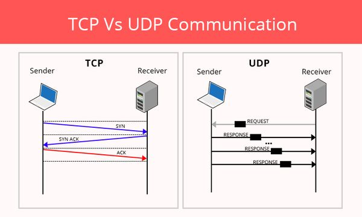
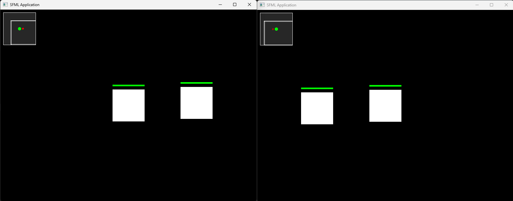
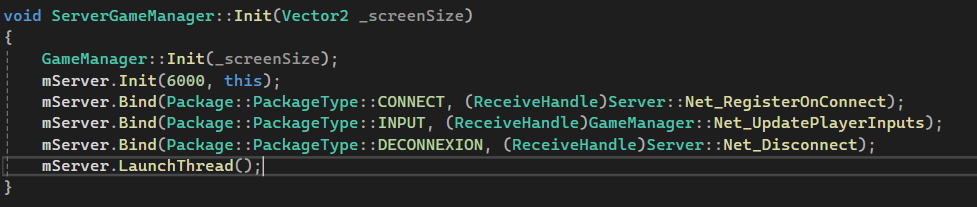
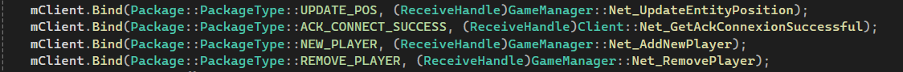

# My First Steps into the Multiplayer

For this College project, I learned how to implement the building bloc of a interconnected game that use UDP protocol to communicate. For this I used the [WINAPI](https://learn.microsoft.com/fr-fr/windows/win32/api/winsock2/) which provied the socket and basic function to send a UDP request.

## What is UDP ?

As you can see on the diagram, UDP unlike TCP, is straight forward. You send a request and the recipient send back all you need BUT it can unordered or even be missing parts. On the other hand, UDP is way faster than TCP that has to wait for the synchronisation.

## My Project

For my project we have been able to connect 2 player, they see eachother and keep track of them in a mini map on the top left corner.

## Our way to achieve this

The architecture that we used to manage package transiting between the server and the client is as follows. 

First who will update the final datas ? 
This is the Server who receive inputs from clients and update the corresponding position. And the client will receive updated datas and display them on screen.

How to create a simple to update and easy to understand package system ?
We used pairs of NAME - FUNCTION to bind package type to a function to treat them. this way, you initialize the binding 1 time on start and never think about it again. Also it group everything in 1 point.

Here you can clearly read the when you receive a "CONNECT" package, you have to register the sender. And behind the scene, you just have to edit the corresponding function "Net_RegisterOnConnect" to affect the behaviour of said event. 

This is the corresponding lines for the client.