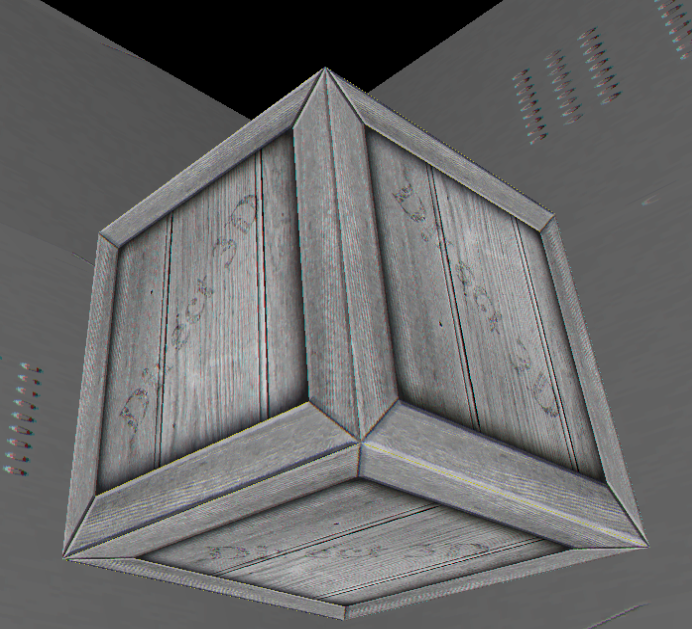
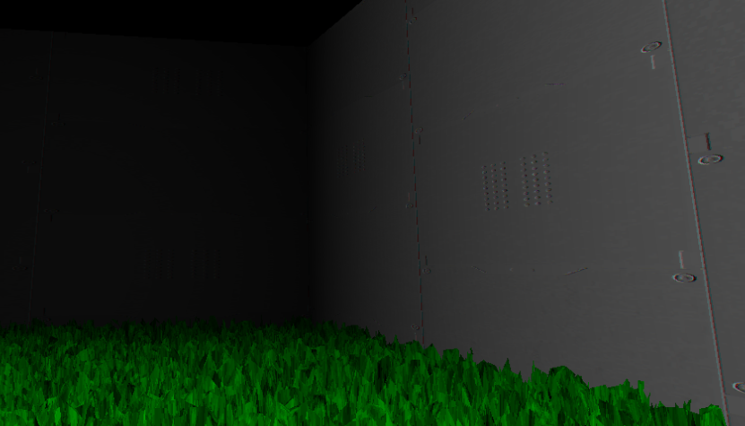
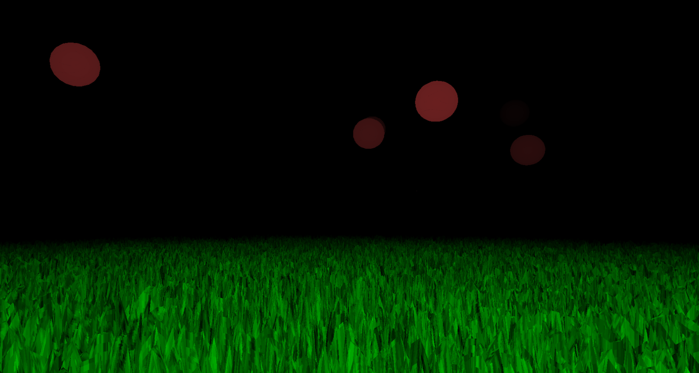
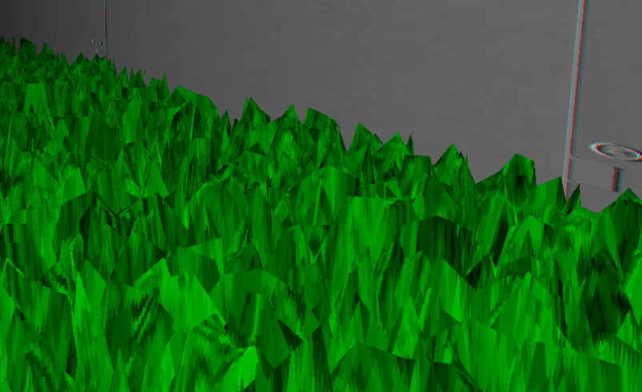

# PIT_Engine

## Introduction

**PIT_Engine** is a basic **game engine built from scratch** using **DirectX**, developed during my **second year at Gaming Campus (GTech)** with **two teammates**.  
The goal of this project was to discover and learn how a **real-time rendering pipeline** works by implementing our own engine **without any prior knowledge of DirectX**.

The project lasted **one month**, which made it particularly challenging. We had to **learn DirectX while using it**, work efficiently as a **team**, and still deliver a functional and coherent solution that met the expected objectives.

Despite these constraints, we managed to build a small but complete engine capable of rendering meshes, handling shaders, and running a simple game.

---

## Project Context & Constraints

At the start of the project:

- None of us had **any experience with DirectX**
- We had a **strict one-month deadline**
- The engine had to be usable to create a **playable experience**
- The project was done in a **team of three**, requiring coordination and clear responsibilities

This forced us to:
- Quickly understand the **graphics pipeline**
- Make **technical compromises**
- Prioritize **robustness and clarity** over advanced features

---

## Rendering & Graphics

The engine is capable of rendering **multiple meshes** using **custom shaders**, with a **textured and lit rendering**.

### Lighting Model

Due to time constraints, we did not implement **dynamic shadows** or complex lighting models.  
Instead, we used:

- A **global ambient light**
- A custom **distance-based shading effect**

To compensate for the lack of shadows and still achieve an interesting visual result, we created a **shader that darkens meshes based on their distance from the camera**.

This creates the impression of:
- A **single light source centered on the camera**
- A progressively darker environment as objects get farther away
- A **claustrophobic and oppressive atmosphere**, which fit well with the game we built on top of the engine

---

## ECS Architecture

To implement gameplay logic, we designed and used a **fully custom Entity Component System (ECS)**.

This ECS was:
- Entirely **implemented by us**
- **Robust and flexible**
- Used for both **game logic** and **engine-level systems**

It allowed us to:
- Cleanly separate **data (components)** from **behavior (systems)**
- Iterate quickly on gameplay features
- Keep the codebase organized despite the short development time

---

## Game Prototype Built With the Engine

To validate the engine in real conditions, we built a **simple shooter prototype** using PIT_Engine during the same one-month period.

The game takes place in a **small enclosed garden**, surrounded by walls, creating a compact and controlled environment.  
Above the player, **large red targets** move through the scene.

The player controls a **small multicolored sphere** that can be launched as a projectile.  
The objective is straightforward:
- Aim at the moving targets
- Shoot them
- Make them disappear on impact

The gameplay itself was intentionally kept **simple**, as the goal of the project was **not game design**, but rather to:
- Validate the **rendering pipeline**
- Test **mesh rendering and shaders**
- Use the **ECS** in a real gameplay scenario
- Ensure the engine could support a complete interactive loop

Despite its simplicity, this prototype successfully demonstrated that the engine was functional, stable, and capable of supporting a small real-time game experience.

---

## Technical Challenge: Grass Rendering

One of the main technical challenges I personally faced was **grass rendering**.

We wanted to add grass to the environment, but:
- We did not have the time or knowledge to implement a **geometry shader**
- Advanced vegetation techniques were out of scope for the project

### Alternative Solution

To work around this, I designed an alternative approach:
- Start from a **subdivided plane**
- Programmatically modify its **geometry**
- Create many vertical spikes that visually resemble grass blades

While simple, this solution:
- Was **cheap to implement**
- Worked well visually in motion
- Fit within our technical constraints

This was a good example of **problem-solving under pressure** and adapting the solution to our actual skill level at the time.

---

## Conclusion

**PIT_Engine** was a demanding but extremely formative project.  
In just one month, we went from **zero knowledge of DirectX** to a working engine capable of rendering a game.

This project helped me:
- Understand the **foundations of real-time rendering**
- Learn how to **work efficiently in a technical team**
- Make informed **technical trade-offs**
- Gain confidence in tackling **complex systems from scratch**

Even though the engine is limited and far from production-ready, it represents a major step in my technical growth and my understanding of low-level game development.