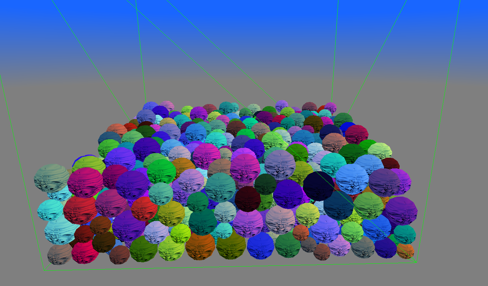
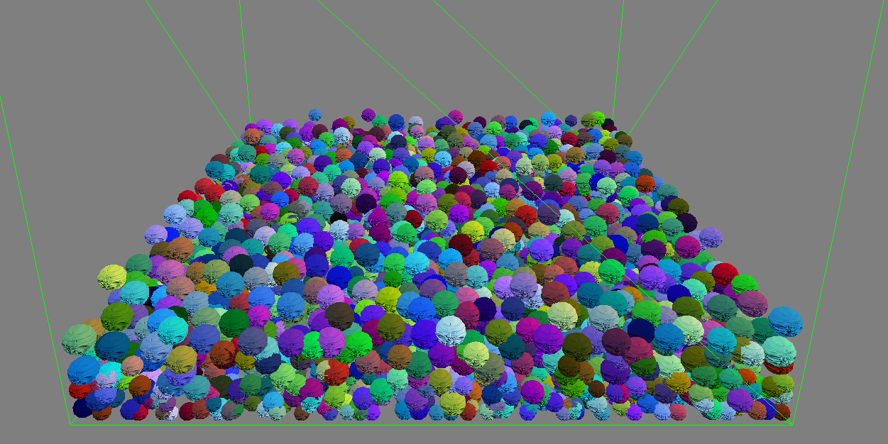
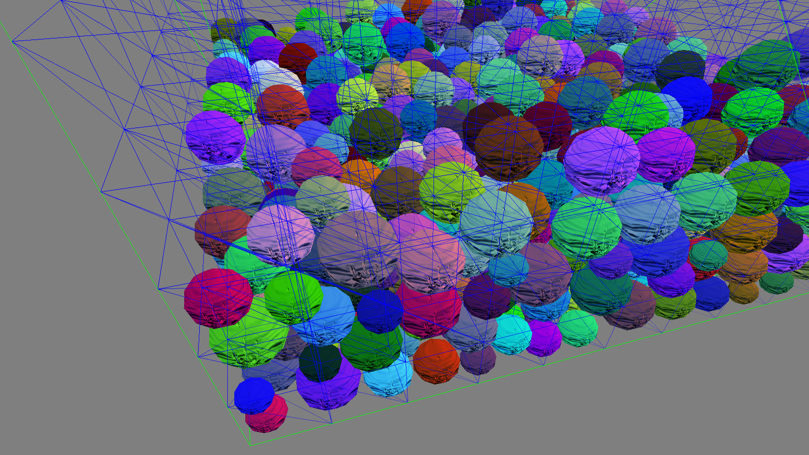
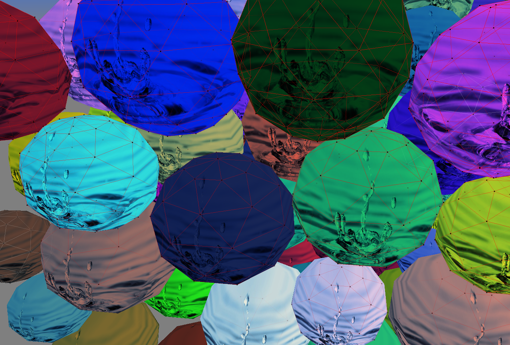
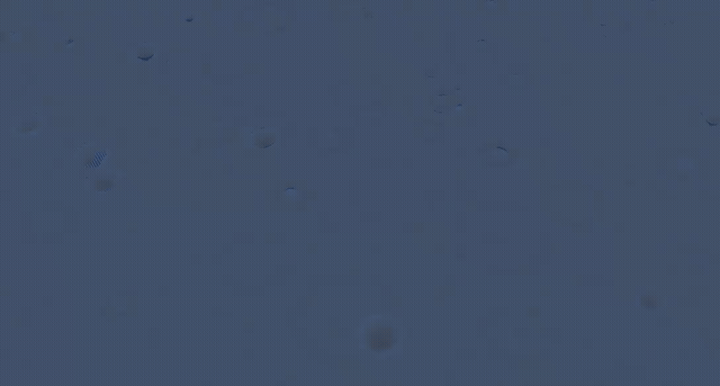
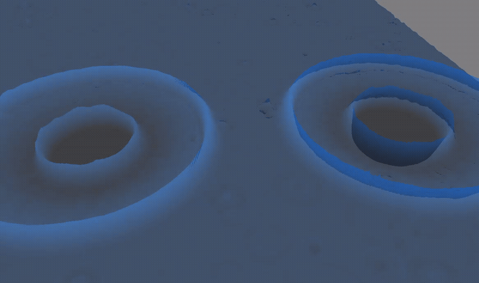

# Physics_Engine

## Introduction

**Physics_Engine** is a **high-performance physics engine** developed in **C++ with OpenGL** during my **third year at Gaming Campus (GTech, Tech – Engine specialization)**, in a team of **three developers**.

The objective of this project was particularly ambitious:
- Build a **realistic physics simulation**
- Handle a **very large number of dynamic entities**
- Deliver a **smooth and stable experience**
- All within a strict **one-week timeframe**

To validate the engine, we chose to simulate a **ball pit scenario**, pushing the system to handle **thousands of interacting objects in real time**.

---

## Project Context & Constraints

At the beginning of the project, we faced several major constraints:

- A **very short deadline (1 week)**
- The need for **real-time performance**
- A requirement for **physically coherent interactions**
- A **team-based workflow** with fast iteration cycles

Our main goal quickly became clear:
> Maximize the number of simulated entities while maintaining stable performance.

This led us to prioritize:
- **Performance over feature completeness**
- **Efficient algorithms**
- **GPU acceleration wherever possible**

---

## Rendering & Simulation Setup

We used **OpenGL** for rendering due to its:
- **Simplicity of integration**
- **Low-level control**
- **Good compatibility with GPU-based workflows**

The simulation consisted of:
- Thousands of **spherical rigid bodies**
- Continuous **gravity and collision interactions**
- A confined environment mimicking a **ball pool**

---

## Performance Results

Thanks to our optimizations, we achieved:

- **~5000 simulated balls at ~30 FPS**
- **~2000 balls at a stable 120 FPS** (on my machine)

These results demonstrated:
- The **scalability of our architecture**
- The effectiveness of our **GPU-based approach**

---

## Spatial Partitioning

One of the first major optimizations we implemented was **spatial partitioning**.

Instead of checking collisions between every pair of objects (which would be extremely costly), we:

- Divided space into **logical regions**
- Assigned entities to these regions
- Only tested collisions between **nearby objects**

This preprocessing step:
- Reduced the number of collision checks dramatically
- Improved overall performance significantly
- Made large-scale simulation feasible

---

## GPU-Based Physics & Collision

The most impactful optimization was moving both:

- **Collision detection**
- **Physics resolution**

…entirely onto the **GPU**.

By doing so, we:
- Leveraged **massive parallelism**
- Avoided CPU bottlenecks
- Drastically increased the number of manageable entities

This approach required:
- Careful **data structuring**
- Efficient **buffer transfers**
- A strong understanding of **parallel computation constraints**

It was a key factor in reaching our performance targets.

---

## Debug & Visualization Tools

To better understand and debug the simulation, we implemented several **visual debugging tools**:

- **Wireframe rendering** for collision volumes
- Visualization of **spatial partitioning zones**
- Real-time feedback on **entity interactions**

These tools were essential to:
- Validate collision correctness
- Tune performance
- Identify edge cases and instability

---

## Additional Feature: Water Simulation

At the end of the project, we had enough time to experiment with an additional system: a **simple water simulation**.

We implemented:
- A **flat water surface**
- Dynamic interactions such as:
  - **Raindrop impacts**
  - **Wave propagation**
  - **Interference between waves**

The simulation was also handled on the **GPU**, allowing:
- Real-time performance
- Smooth and reactive behavior

Notably, we reproduced effects such as:
- The **delayed upward splash after a droplet impact**
- The interaction between waves that **combine and cancel each other**

---

## Technical Challenges

### Extreme Time Constraint

Building a physics engine in **one week** required:
- Fast decision-making
- Clear task distribution
- Efficient iteration

### Large-Scale Collision Handling

Handling thousands of objects meant:
- Avoiding **O(n²) collision checks**
- Designing scalable systems from the start

### GPU Transition

Moving physics to the GPU introduced challenges such as:
- Data synchronization
- Debugging complexity
- Adapting algorithms to **parallel execution models**

---

## Conclusion

**Physics_Engine** was an intense and highly rewarding project focused on **performance-oriented system design**.

In just one week, we managed to:
- Build a **scalable physics engine**
- Simulate **thousands of interacting entities**
- Leverage the **GPU for both physics and rendering**
- Deliver a **stable and visually convincing simulation**

This project strengthened my skills in:

- **Optimization techniques**
- **Parallel programming**
- **Physics simulation fundamentals**
- **Real-time system design under constraints**

It also reinforced an important lesson:
> Smart architecture and the right optimizations matter more than raw complexity when working under tight constraints.