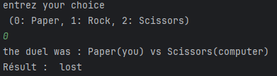
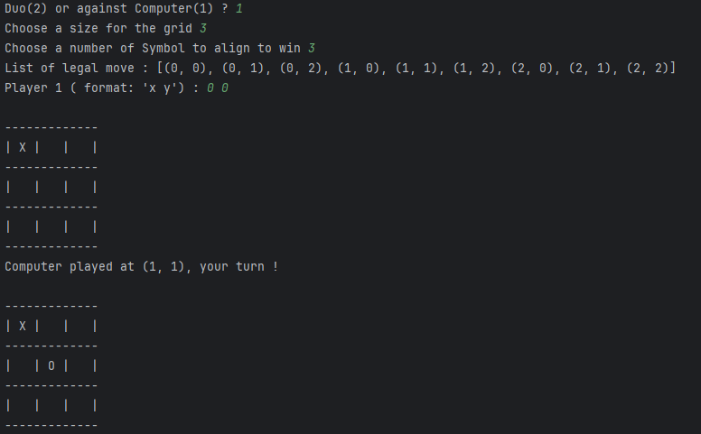
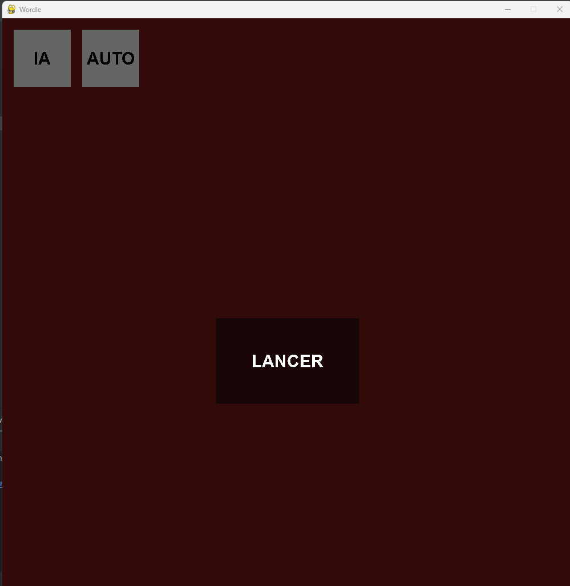
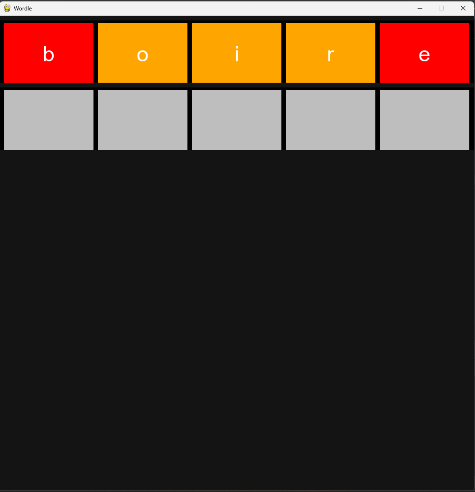
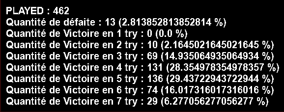
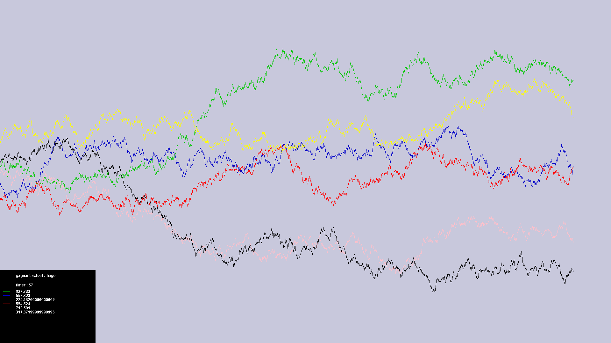

# Python-Games

## Intoduction

At the time when i write this, i'm 2 years after the last push of this **project** so i dont remember every details. But the context is a project during *my first year of study*. In this project we were supposed to learn **Python** but as I was coding with Python since 2 years at this time, I started creating minigames as fast as i can. The duration of the project was **2 weeks** and I achieved to create **5 mini-project** : 

- More or Less
- rock-paper-scissors
- Tic-Tac-Toe
- Worldle
- Simulation of the stock market

---

## Project 1 : More or less

This first project is a simple **game** that follow a few rules : 

- Choose a **minimum** and a **maximum** for a *random* number to be generated.
- Set a **number of try**.
- **Try to guess** the number and the game will tell you if the objective is **more or less**.

if you guess the correct number in less than the choosed amount of try, then you win !

Before looking at what the game look like, it is **important** to notice that any **invalid input** will be **ignored** and will result in **retrying** to ask the same input. **Valid input** contains only **0123456789**.

>

In my **Editor**[^0], a game will look like this:

First, i take **two inputs** for the **minimum** and the **maximum** between which a random number will be generated.

>

Next, you will be **asked** a **number** of try, the *higher*, the *easier*. Here i choosed to try to find a number between 0-100 in 10 try. Therefore, I guessed 50 (choose the median is a good start to eliminate half the possibilities). Here i know that the answer is **between 50 and 100**.  

>

Later, I encountered a number where the game said that the answer is **less** that it. So the Answer is between 75 and 87.  

>

Finally, I Tried different number until I guessed the **correct answer**, here it was 86 !

>

Alternally, if i had **failed** to find the correct number in 10 try, this is what i would have get.

>

## Project 2 : Rock-Paper-Scissors

Next is a pretty **common game** that anyone played as a child, **Rock-Paper-Scissors** !

>

The **computer** choose at **random** so this is a basic project that can be **enhanced**.

## Project 3 : Tic-Tac-Toe

Everybody know **Tic-Tac-Toe**, this is a training project that allow you to play tic-tac-toe **with someone**, or **against the computer**. If you play against the computer and he can **win** in 1 move he will do it on the contrary if he is going to **lose** in 1 move he will try to prevent that.

>

## Project 4 : Wordle 

this project is **more advance** that the other 4. Here i made a real **wordle** cap with **5 letters**. I gathered a big list of legal words (*in French*) that are 5 letters long. and built an **interface** that allow for playing.

>

there are 3 main components. first the *'Lancer'* **button** to start a normal game. 

>

You arrived in this **window** which allow for **typing** 5 letter, **removing** them, **re-writing**, and press enter to **check** the letter (if the input is illegal, nothing will append). Then the **red** letter are *not in the word*, **yellow** one are *missplaced* and **green** ones are *correct and well placed*. You have until **7 try**. 

Also you may have seen the *'AI'* **button** it can be used to **automaticaly** check for the *best word* at an instant. This is an **algo** that **i developped** and that has pretty good result. This is where the *'AUTO'* **button** comes handy, it is used to *simulate hundred of games* to see how well my AI perform.

>

In **462** games, it lost only **13** times. which represent **2.81%** of the games ! Additinaly, you can see a beautiful **Gaussian ditribution** on the other number of try centered in 4 to 5 try.

## Project 5 : Simulation of the stock market

This is a little project with an **interface** that i made *quickly*, we used this to **bet on a curve**. And in reality, those are **completely random**. they simply choose between -1 and +1 at each frame and add this to they current height and this create this **nice effect**.

Here it was *Tiago* with the *green curve* who was leading. and there is a **timer** that at its end close the simulation and *tell us who was first*. which is **fun** to pick someone at random it make some **suspense**.

---

## Conclusion

Those **5 projects** were a *base* from which i only *gain* in **methodology** and **quality**. Those are *not perfect* at all but they are where i **come from** and here to tell me how i **evolved**.

[^0]: I'm using Pycharm as my main editor for all my python projects