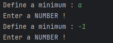
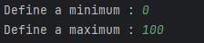
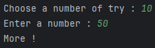
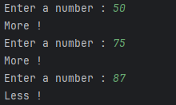
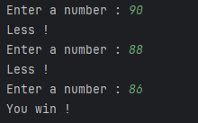
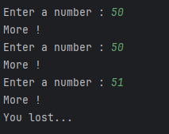

# Python-Games

## Intoduction

At the time when i write this, i'm 2 years after the last push of this **project** so i dont remember every details. But the context is a project during *my first year of study*. In this project we were supposed to learn **Python** but as I was coding with Python since 2 years at this time, I started creating minigames as fast as i can. The duration of the project was **2 weeks** and I achieved to create **5 mini-project**.

---
## Project 1 : More or less

This first project is a simple **game** that follow a few rules : 

- Choose a **minimum** and a **maximum** for a *random* number to be generated.
- Set a **number of try**.
- **Try to guess** the number and the game will tell you if the objective is **more or less**.

if you guess the correct number in less than the choosed amount of try, then you win !

Before looking at what the game look like, it is **important** to notice that any **invalid input** will be **ignored** and will result in **retrying** to ask the same input. **Valid input** contains only **0123456789**.

In my **Editor**[^0], a game will look like this:

First, i take **two inputs** for the **minimum** and the **maximum** between which a random number will be generated.

Next, you will be **asked** a **number** of try, the *higher*, the *easier*. Here i choosed to try to find a number between 0-100 in 10 try. Therefore, I guessed 50 (choose the median is a good start to eliminate half the possibilities). Here i know that the answer is **between 50 and 100**.

Later, I encountered a number where the game said that the answer is **less** that it. So the Answer is between 75 and 87.

Finally, I Tried different number until I guessed the **correct answer**, here it was 86 !

Alternally, if i had **failed** to find the correct number in 10 try, this is what i would have get.

[^0]: I'm using Pycharm as my main editor for all my python projects