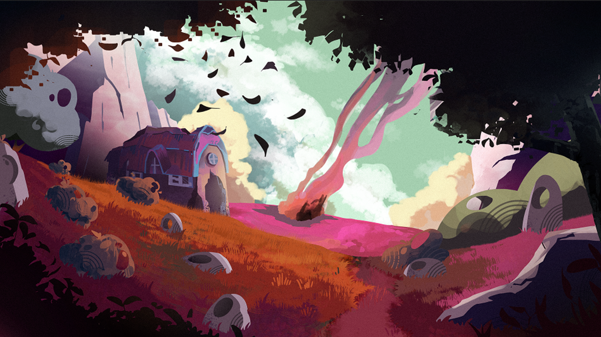
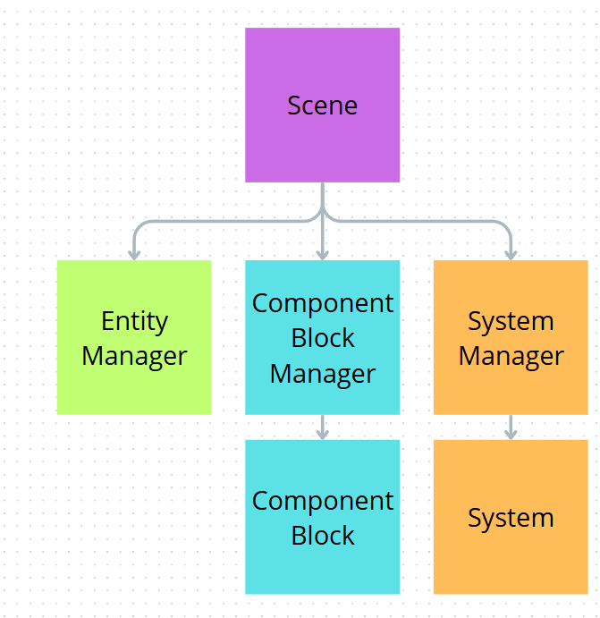
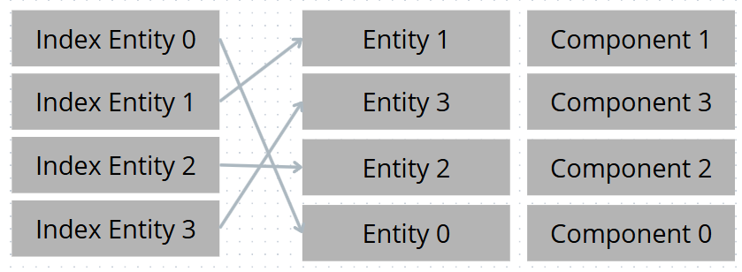
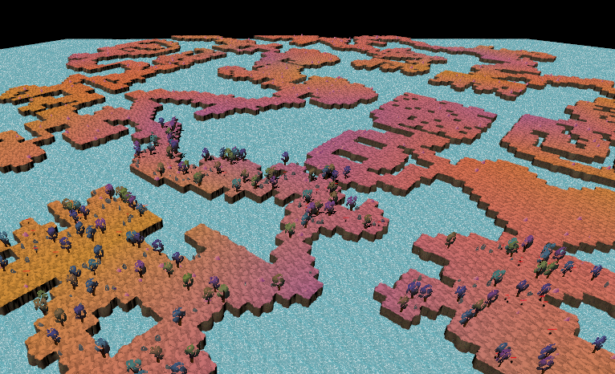
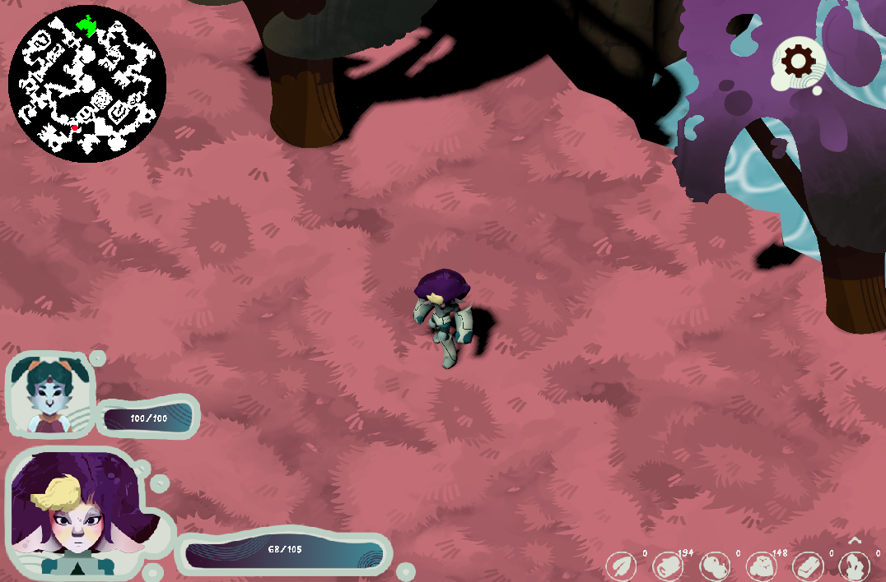

# Ruins of Hestia

>

Ruins of Hestia is a game created by a team of **21 students**. In this game, you follow **Cali**, an alien who crashes onto **Hestia**, a lush paradise-like planet hiding a corruption that threatens its helpless inhabitants. Despite the situation, Cali is rescued by the **Persephins**, a merchant people lacking both defensive means and resources. Moved by their kindness, Cali decides to help them **survive and prosper**.

## Project Context

This project was our **final year project**, and there were several constraints for our **technical team of 9 people**.

### Constraints

- Create our own **custom engine**
- The game had to include **procedural generation**
- **C++ development**

### Freedom

- Choice of **rendering library**

This is why we decided to use **Vulkan** for its portability and long-term viability. It gave us a high level of freedom while also being a modern and a **future-proof solution**.

**The objective of the project was not to deliver a finished game, but a playable Vertical Slice.**

---

## My Role

On this project, I was one of the two **Lead Developers**. I was responsible for the **code architecture** and **production management** to ensure the project remained stable throughout development. My colleague handled communication within the technical team and with the other departments (**art and business**).

---

## The Custom Engine

Within the engine, I built the foundations, including a **Scene system** and a clear, flexible, and performant **ECS system**. Throughout production, I also maintained and evolved these systems to adapt to my teammates’ requests and feedback. I also created an **Asset Loader** to manage the different resources.

##### The ECS System

The ECS system was designed to provide **advanced flexibility and control** for experienced **C++ developers**. It provides complete control over its behavior while maintaining **excellent performance**.

>

In the diagram above, we can see the different relationships between the managers. The user only interacts with the **Scene**, which acts as the central point and redistributes data. However, when adding a new feature to the ECS, the **Component Block** and the **System** are the parts that need to be modified.

More specifically, developers inherit from `Component` and `System` to create new classes capable of handling the desired feature. From these inherited classes, developers have complete access to the rest of the ECS and the Scene, along with many callbacks that can be placed wherever they are most relevant in the **Scene update pipeline**. This allows every system to update in the correct order relative to one another, enabling various optimizations.

It is also worth noting that the **Component Block** class required significant design consideration and now has only one constraint: a **compile-time maximum entity count**. This gives us an architecture where **access, insertion, and deletion are all O(1)**. The system works thanks to **three arrays inspired by the sparse set structure**.

>

Thanks to this setup, I can add elements in **O(1)** at the end of the right array while writing the index into the left array. Access is also **O(1)**: I read the index on the left and retrieve the corresponding data on the right.

Deletion is also performed in **O(1)**. For example, to remove **Entity 2**, I take the last element, here **Entity 0**, and overwrite Entity 2’s data and associated entity. Then I only need to fix the modified indices on the left side, and the operation is complete.

---

## The Game

The gameplay is divided into **two parts**. One part takes place in the village, where the player manages their settlement in a **City Builder** style, while the second part focuses on exploration, where Cali ventures into a **Rogue-Lite** environment to gather resources used to improve both equipment and the village.

I was personally responsible for the entirety of the **exploration gameplay**, except for the UI.

### Tasks I Worked On

- **Procedural environment generation**
- **Character controller**
- **Camera management**
- **Resource and enemy spawning**
- **Enemy AI**
- **Game Feel** (resource gathering, movement)
- **Mini-map**
- **Optimization**

### Map Generation

Map generation was one of the parts I enjoyed the most because it is both creative and satisfying to watch the world build itself.

To achieve this, I took inspiration from **Oskar Stålberg’s** work on **Townscaper** and reused the **dual grid** concept to generate terrain from different tiles.

>

The terrain generation process is divided into **8 steps**:

- Create a layout defining the overall shape and size of the generation
- Solve the maze structure
- Select rooms for each grid cell
  - Different rooms were handcrafted to maintain control and reduce unfair procedural generation
- Determine the connections between neighboring rooms to guarantee proper room connectivity
- For each room and its connections, use the **dual grid system** to determine the required tiles
- Build the room mesh using the generated tile data (**draw call optimization**)
- Generate resources and enemies in each room according to the level design setup
- Generate the mini-map texture using tile data

To finish, I would like to talk about **optimization**. In order to maintain a **smooth framerate**, I implemented several optimization techniques.

First, during generation, I create **one mesh per room**. Otherwise, I would need to render **17x17 smaller unique meshes**, which is extremely inefficient for the GPU. Instead, I rebuild the geometry using smaller rotated meshes.

I also apply **culling** to scripts and terrain that are too far from the player. Using the camera viewpoint, I can quickly determine what has no chance of appearing on screen in the near future. As a result, I disable the visuals and behavior of terrain, resources, and enemies located more than **one room away** from the player. This check is only performed when the player changes rooms.

>

## Conclusion

As a **Lead Developer**, I learned how to **lead a team**, **organize production**, give **clear directions**, and successfully carry a project through by solving the many problems encountered along the way in an agile manner, all while dealing with **time pressure**, **deadlines**, and **team communication**.

As a developer, this project was also extremely instructive. I had the opportunity to apply my **technical skills** while working within the constraints of both a **production schedule** and a **team environment**. I learned how to adapt to different situations and how to work efficiently under pressure.

Overall, the project went very well and was appreciated by the jury who reviewed and evaluated our work.

