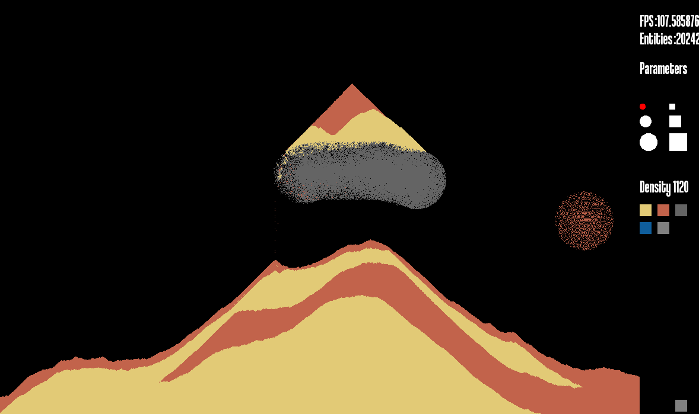
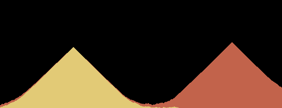
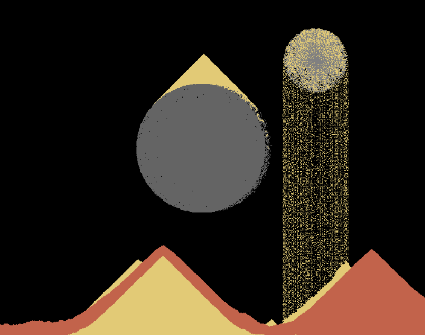

# Sand Simulation

## Introduction

**Sand Simulation** is a **massive particle simulation system** developed in **C++** with a focus on **multithreading and performance optimization**.

The objective of this project was to create a simulation capable of handling a **large number of particles in real time**, while optimizing the workload using **multiple CPU threads**.

The main constraint was to implement the entire threading architecture using the **native Windows C++ threading API**, without relying on the **standard library threading tools (`std::thread`)**.

To answer this challenge, I decided to create a **sand simulation based on a cellular automaton**, where each pixel represents an individual particle with its own behavior and interactions.

---

## Project Context & Objectives

The project requirements were:

- Create a **massive particle simulation**
- Optimize the simulation using **multi-threading**
- Avoid using high-level threading abstractions
- Work directly with the **Windows threading API**

The main challenge was not only to distribute computation across multiple threads, but also to ensure:

- Data consistency
- Thread synchronization
- Avoidance of race conditions
- Efficient workload distribution

The goal was to create a system that could scale to thousands of particles while maintaining a high frame rate.

---

## Cellular Automaton Approach

For the simulation itself, I chose a **cellular automaton approach**.

Instead of simulating complex physics equations, each particle follows a set of local rules based on its surrounding environment.

This allowed us to create emergent behaviors such as:

- Sand falling due to gravity
- Sand stacking naturally
- Particles interacting with their neighbors
- Different materials having different behaviors

The simulation supports multiple particle types:

- **Colored sand particles** capable of falling and mixing
- **Stone particles** that remain static
- Empty cells that can be modified dynamically

This approach provided a good balance between:
- Visual quality
- Computational efficiency
- Large-scale simulation capability

---

## Custom Threading Architecture

Since standard threading libraries were not allowed, I designed a custom abstraction layer on top of the Windows threading API.

The architecture is based on a **Thread / ThreadHandle pair system**.

### Thread

The **Thread object** is responsible for:

- Creating and accessing a thread
- Managing communication from the main application
- Providing controlled access to thread resources

### ThreadHandle

The **ThreadHandle** represents the thread from its own execution context.

Its purpose is to:
- Manage the running thread internally
- Restrict access to only authorized data
- Prevent unsafe modifications from external systems

This separation ensures that:

- The main thread cannot directly manipulate thread-owned data
- Worker threads only access resources explicitly provided to them

This architecture greatly reduces the risk of unsafe memory access and improves code reliability.

---

## Thread Synchronization with ThreadScheduler

To coordinate multiple groups of threads, I designed a dedicated synchronization system called **ThreadScheduler**.

Its role is to:

- Launch multiple threads simultaneously
- Wait until all threads have completed
- Release data for the next processing stage
- Synchronize multiple computation steps

This system works as a pipeline:

1. Start a group of worker threads
2. Execute a specific task
3. Wait for every worker to finish
4. Safely continue to the next stage

This architecture was especially important during the **space partitioning process**, where multiple threads needed to work on different regions of the simulation.

---

## Spatial Partitioning Optimization

One of the biggest performance improvements came from optimizing which particles actually needed to be updated.

Instead of processing every particle every frame, the simulation keeps track of:

- Which regions changed during the previous frame
- Which areas may contain moving particles
- Which sections can safely be skipped

Only modified groups are updated.

This optimization dramatically reduces unnecessary calculations, especially when large areas of the simulation remain static.

---

## Avoiding Race Conditions

The biggest technical challenge of the project was ensuring safe parallel execution.

### Neighboring Thread Conflicts

During space partitioning, threads must never process two adjacent regions simultaneously.

Otherwise, two threads could attempt to modify the same cell, creating:

- Data corruption
- Incorrect particle behavior
- Unpredictable results

To solve this, the scheduler guarantees that conflicting regions are never updated at the same time.

---

### Particle Collision Conflicts

Another challenge occurs when multiple particles attempt to move into the same location.

For example:
- Two grains of sand falling toward the same cell
- Two updates trying to overwrite the same memory location

The simulation required careful ordering and synchronization rules to ensure deterministic behavior.

---

## Final Result

The final application allows users to interact with a large-scale particle simulation featuring:

- Multiple sand colors
- Falling and stacking behavior
- Static stone particles
- Particle deletion
- Automatic sand generation

The sand generator continuously creates new particles on neighboring cells, allowing the simulation to dynamically evolve.

---

## Performance

The final result achieved a high level of performance despite every pixel representing an individual particle.

The simulation is capable of:

- Filling the entire screen with particles
- Maintaining a high frame rate
- Scaling efficiently across multiple CPU cores

The application was tested on a processor capable of running **up to 12 simultaneous threads**, allowing the workload to be distributed efficiently.

---

## Technical Challenges

### Low-Level Thread Management

Working directly with the Windows threading API required understanding:

- Thread lifetime management
- Synchronization primitives
- Safe data sharing

### Parallel Data Processing

Designing a simulation that could run in parallel required:

- Dividing the workload efficiently
- Preventing memory conflicts
- Synchronizing multiple computation phases

### Performance Optimization

The main challenge was finding the right balance between:

- Simulation accuracy
- Number of processed particles
- Thread overhead

---

## Conclusion

**Sand_Simulation** was a challenging project focused on **low-level multithreading and performance engineering**.

Through this project, I learned how to:

- Design a custom threading architecture
- Work directly with the Windows API
- Synchronize complex parallel workloads
- Optimize large-scale simulations using spatial partitioning

This project strengthened my understanding of:

- **Concurrent programming**
- **Data-oriented design**
- **CPU optimization techniques**
- **Real-time simulation architecture**

Creating a fully interactive sand simulation with thousands of particles demonstrated how careful architecture and optimization can transform a simple concept into a highly scalable real-time system.