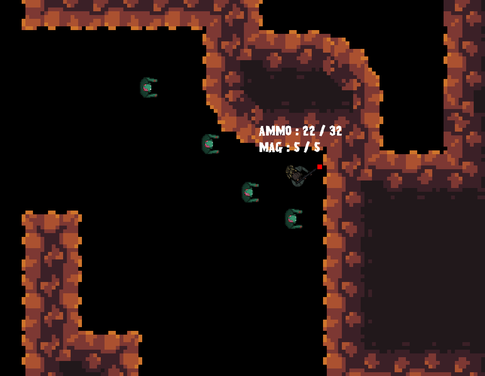
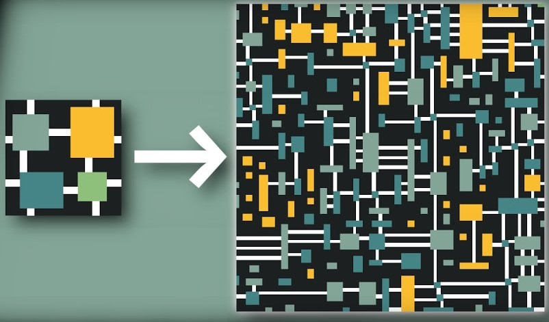

# My First Application of a state machine in an arcade type of game

In this **College C++ project**, We were asked to use a **state machine** in any game we could think of, by **team of 3**, in **2 weeks**. What we decided to take inspiration of for our game is *Dead Ops Arcade* a top down game where you shoot wave of enemies. And we would apply the State machine to the weapon (*Relaod / Shoot / Idle*) and for the enemies (*Run / Attack / Idle*).

## Visuals 

## What is a state machine ?

A **state machine is a tool** often used to represent somthing with various state it can be in but not the others. As an exemple for the weapon, if you reload, you cant be shooting so a state machine make sens. In a C++ project, it will be **separated into 4-5 class**. First **Action**, Action represente some code to run while in a state. Next **Condition**, represente a test that will be perform to try to change state. Also there will be **Transition** which store multiple Condition and an index toward which go if when he perfrom all tests, it doesn't fail. And finally there is **Behaviour** which stock Transitions and Actions so that if you update Behaviour, it will either update Action or transit to another behaviour. Also there is of course a "**State Machine**" class that wrap all Behaviours. 

In resume : 
- State Machine
  - Behaviour(s)
    - Transition(s)
      - Condition(s) => Test to switch between behaviour
    - Action(s) => Code performed
  
## Other interesting things (Wave Function Collapse)

In this project I implemented **an algorithme** that I particularly like : **Wave Function Collapse**. It take as **input** a **set of tile** and **rules** to connect them. And **output** a **grid** with a **random placement** of the tile that follow the rules. The principle is extremely simple but also very effective : at every instant of the algorithme, each cell in the grid contains the number of tile that can be at this place and respect all rules. 

The Algorithme say : 
 - take the one with the least entropy (*entropy here is represented by the number of possibility*)
 - chose one possible at random
 - repeat

It is more commonly used to **generate map** where you can go in any tiles and you want to generate it proccedualy, first you can replace the yes / no to the rules by factor of "*it is likely that those to are close*" where 0 represent impossible and any positive float is a scalor for how likely it is, and when you have to pick one at random you only need to account for each strength in the randomness. With it you can generate logical tilemap. Moreover, when you generate a closed grid, it doesn't matter if you fix the exterior border. So you can expand an already generated area by running the algorithme on an other area given the connection with the already generated. Finally, For more complexe behaviour, you can check not only the 4 neighbour but 8, or even at a distance of 2, resulting in more complexe rule set or even use a hexagonal grid or a 3^rd^ dimension, it doesn't matter !
